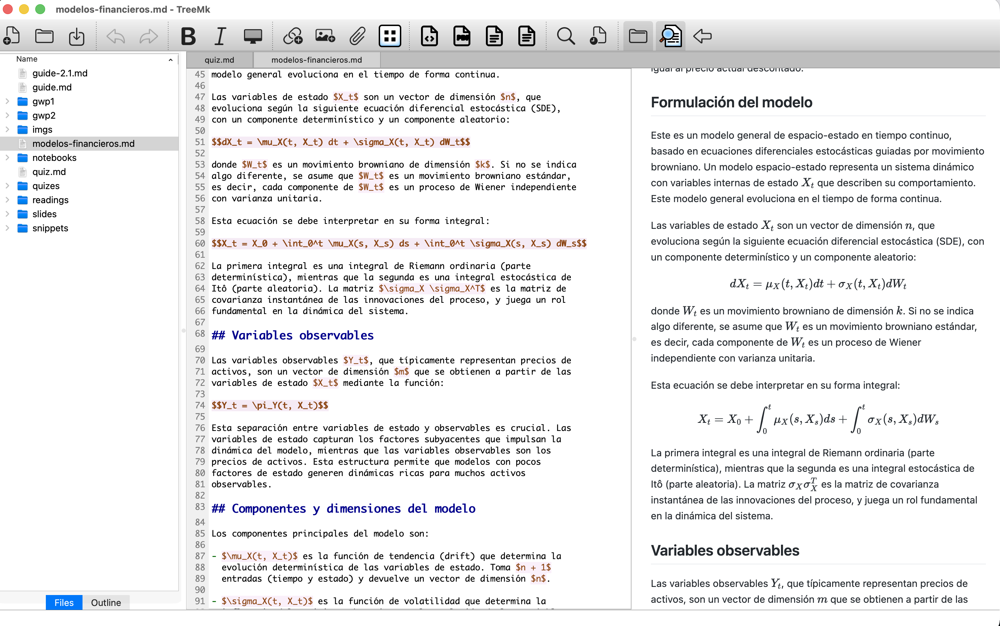

# TreeMk - Integrated Markdown Editor

TreeMk is a desktop Markdown editor that works directly with your file system—no proprietary vaults, no lock-in, just your files organized your way. Built with Qt, it combines a powerful text editor with a file explorer, wiki-style linking, and rich content rendering.

**Work with your files, where they already are.**

TreeMk doesn't move your notes into a special database or vault. It simply provides an integrated environment for editing and navigating Markdown files across any folder on your system.



## Features

**Editor**

- Multi-tab editing with session management
- Line numbers and line highlighting
- Word prediction based on workspace vocabulary
- Auto-indent and auto-close brackets/quotes
- List continuation and hanging indent formatting
- Customizable keyboard shortcuts
- Paste images directly from clipboard
- Smart text navigation
- Line breaking and joining utilities
- AI assistance (Ollama or OpenAI-like providers)

**Navigation and Organization**

- File system tree view for note organization
- Wiki-style linking between notes with `[[note]]` syntax
- File inclusion with `[[!note]]` syntax - embeds content in preview
- Markdown links `[text](url)` with Ctrl+Click to follow
- Task lists with checkbox support
- Drag & drop from the file explorer to create wiki-links
- Backlinks panel - shows all notes linking to current document
- Document outline panel with heading navigation
- Quick open dialog (Ctrl+P) with fuzzy search
- Full-text search across all files
- Recent folders menu

**Preview and Rendering**

- Live Markdown preview with syntax highlighting
- LaTeX formula rendering (inline `$...$` and block `$$...$$`)
- Mermaid diagram rendering
- Code syntax highlighting in preview
- Custom CSS support for preview styling
- Configurable preview refresh rate

**Theme and Appearance**

- System, light, and dark theme support
- Customizable fonts and sizes (editor and preview)
- Theme-aware UI elements

**Export**

- Export to HTML, PDF, and DOCX (via Pandoc)
- Export to plain text
- Mermaid diagrams in exports (requires mermaid-filter)

## Requirements

- Qt 6.2 or higher
- CMake 3.16 or higher
- C++17 compatible compiler
- md4c (for preview rendering)
- pandoc (for export features)

pandoc is required to export notes to formats like HTML, PDF, and DOCX.
pandoc needs to be installed separately.

## JavaScript Libraries

The app bundles the following JavaScript libraries locally:

- **KaTeX** - LaTeX formula rendering
- **Highlight.js** - Code syntax highlighting
- **Mermaid** - Diagram rendering

These are bundled into a single minified file (`preview-bundle.min.js`) using Bun.

**Rebuilding the bundle** (only needed if updating library versions):

```bash
# Install Bun if not already installed
curl -fsSL https://bun.sh/install | bash

# Install dependencies and build bundle
bun install
./build-preview-bundle.sh
```

The bundled files are included in the repository, so rebuilding is not required for normal builds.

To render Mermaid diagrams when exporting to HTML, PDF, or DOCX with Pandoc,
you need to install `mermaid-filter`:

```bash
npm install -g mermaid-filter
```

If `mermaid-filter` is available in your PATH, it will be automatically used
during export. Otherwise, Mermaid code blocks will be exported as regular
code blocks.

## Building from Source

Clone the repository:

```bash
git clone git@github.com:jailop/treemk.git
cd treemk
```

For MacOS:

```bash
brew install cmake qt6
```

Linux:

For Debian/Ubuntu-based systems, install the required packages:

```bash
sudo apt install build-essential cmake qt6-base-dev qt6-webengine-dev qt6-svg-dev libmd4c-html0-dev pandoc
```

For Fedora:

```bash
sudo dnf install @development-tools cmake qt6-qtbase-devel qt6-qtwebengine-devel qt6-qtsvg-devel pandoc md4c-devel
```

For VoidLinux:

```bash
sudo xbps-install cmake gcc make qt6-base-devel qt6-webengine-devel qt6-svg-devel pkg-config md4c-devel
```

For FreeBSD:

```
pkg install cmake pkgconf gcc qt6-base qt6-webengine qt6-svg md4c
```

To build the app:

```bash
# Create build directory
mkdir build
cd build

# Configure with CMake
cmake ..

# Build
cmake --build .

# Run for linux
./treemk

# Run MacOS
open treemk.app

# To install in Linux
sudo cmake --install .

# To create DMG in MacOS
cd ..
./create_dmg.sh
```

Windows:

Additional requirement requirement:

- Visual Studio 2019 or later (with C++ support)

```bash
# Create build directory
mkdir build
cd build

# Configure with CMake (adjust Qt6_DIR if needed)
cmake .. -G "Visual Studio 17 2022" -A x64 -DCMAKE_PREFIX_PATH="C:/Qt/6.x.x/msvc2019_64"

# Build
cmake --build .
```

## Documentation

Comprehensive documentation is available online:

**📚 [Read the Documentation](https://jailop.github.io/treemk)**

### Building Documentation Locally

```bash
# Serve documentation locally
./serve-docs.sh

# Or manually:
source .venv/bin/activate
mkdocs serve
```

Visit http://127.0.0.1:8000 to view the documentation.

## Contributing

Visit [Contributing to
TreeMk](https://jailop.github.io/treemk/contributing/) for guidelines on
how to contribute to the project, report issues, and submit pull
requests

## License

TreeMk is licensed under the GNU General Public License v3.0. See
[LICENSE](LICENSE) for details.

Third-party libraries used in TreeMk are subject to their own licenses.

## Disclaimer

TreeMk is provided "as is" without any warranties. The developers are
not liable for any damage or loss of data resulting from the use of this
software. Always back up your notes before using new software.
