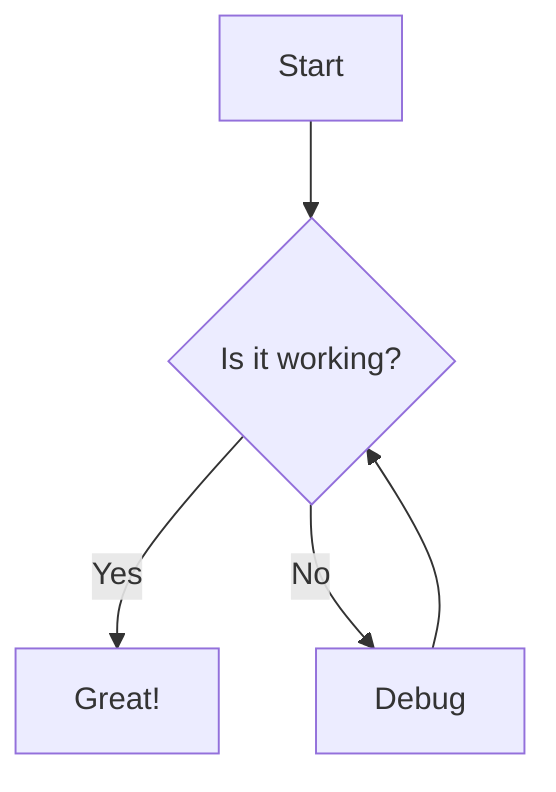
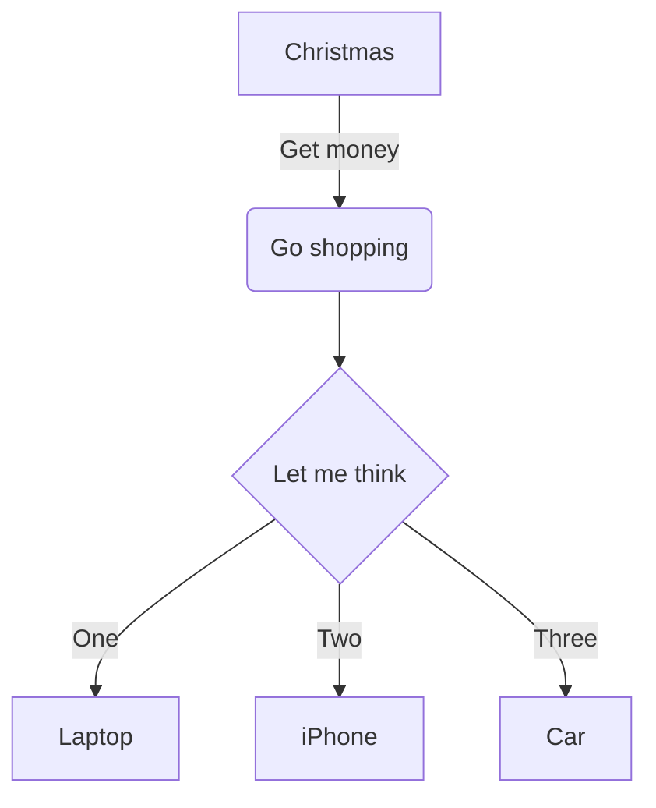
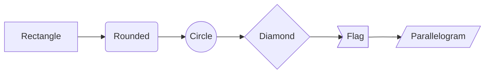
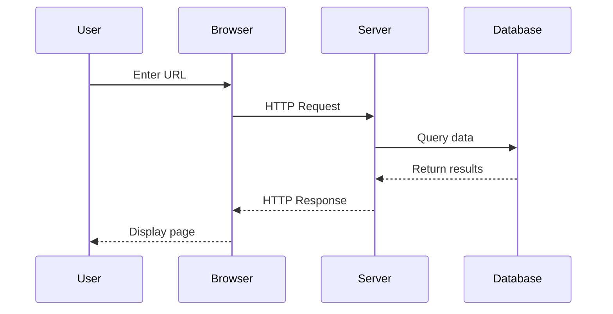
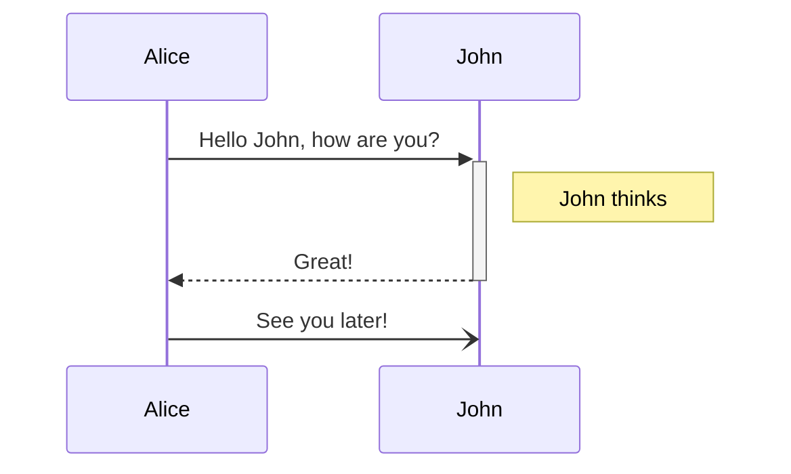
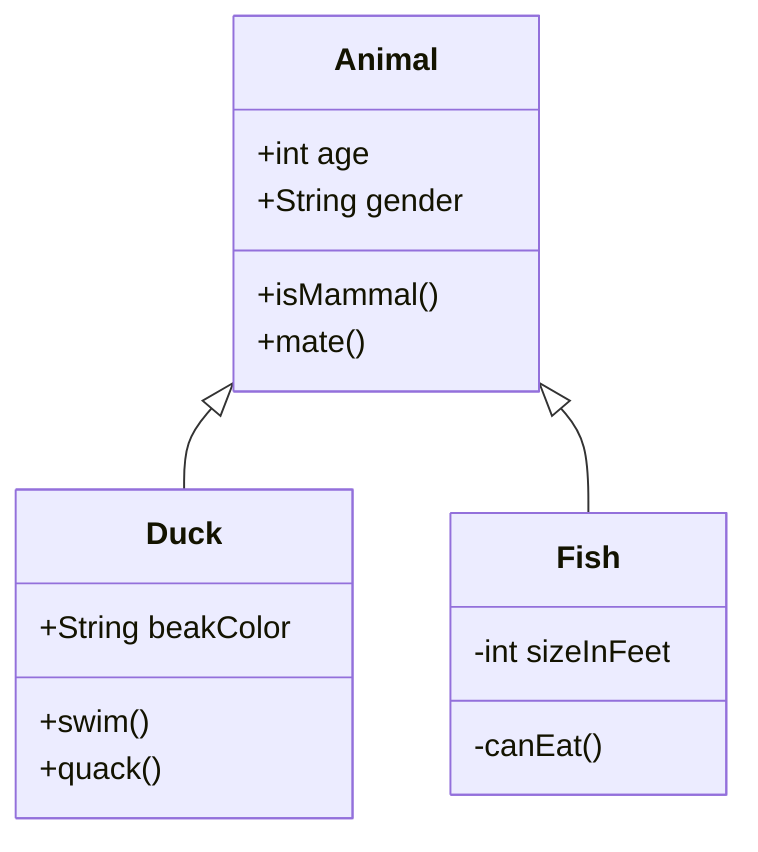
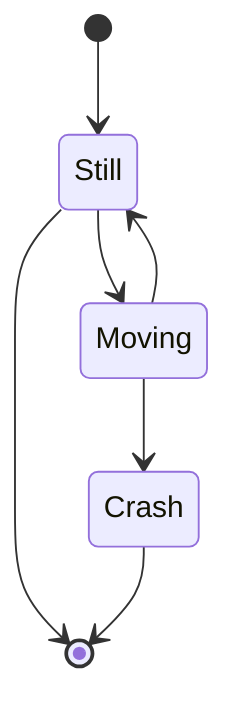
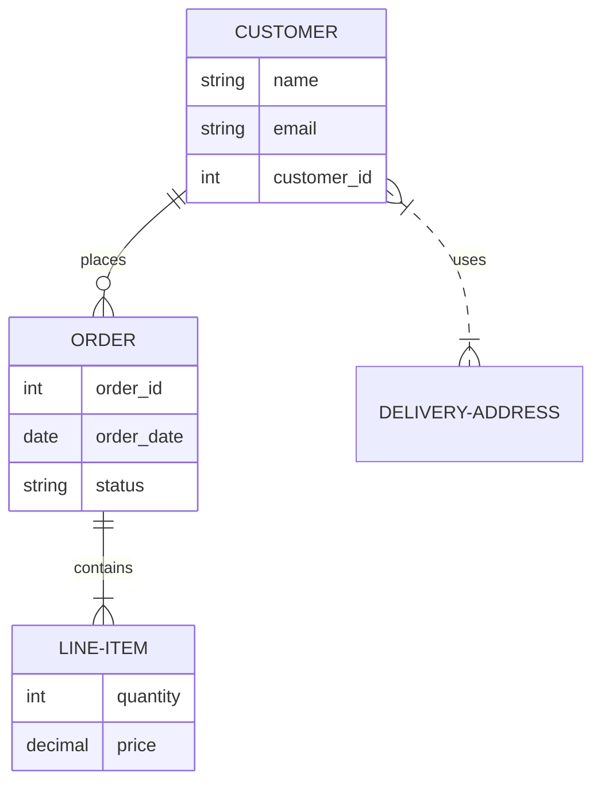
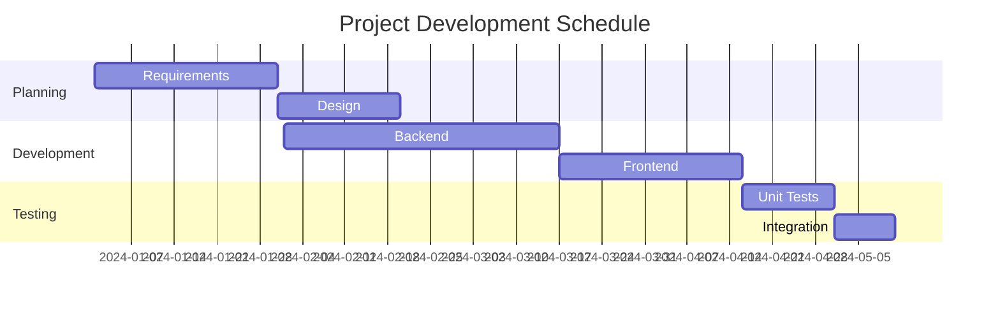
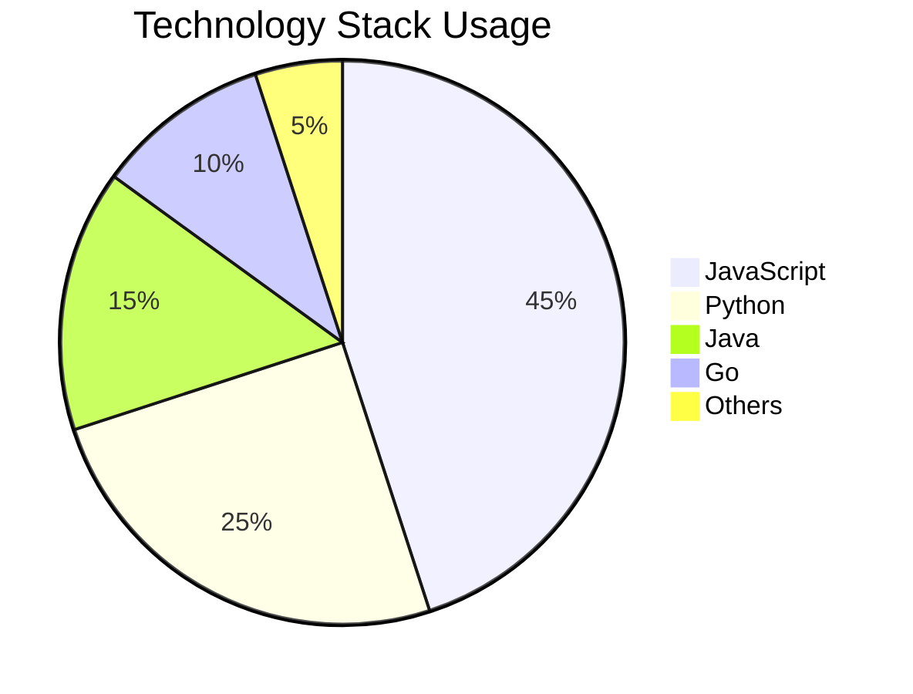

# Diagrams with Mermaid

TreeMk supports creating diagrams using Mermaid syntax. Create flowcharts, sequence diagrams, Gantt charts, and more using simple text-based notation.

## Creating Diagrams

Create a Mermaid diagram using a code block with the `mermaid` language identifier:

````

````

**Result:**


## Flowcharts

### Basic Flowchart

````

````


### Node Shapes

````

````



### Flow Direction

- `graph TD` - Top to bottom (default)
- `graph LR` - Left to right
- `graph BT` - Bottom to top
- `graph RL` - Right to left

## Sequence Diagrams

Show interactions between participants over time:

````

````


### Activation and Notes

````

````


## Class Diagrams

Visualize object-oriented class structures:

````

````


## State Diagrams

Show state transitions:

````

````


## Entity Relationship Diagrams

Database relationships:

````

````


## Gantt Charts

Project timelines and schedules:

````

````


## Pie Charts

Data visualization:

````

````


## Git Graph

Version control visualization:

````
```mermaid
gitGraph
    commit
    commit
    branch develop
    checkout develop
    commit
    commit
    checkout main
    merge develop
    commit
    branch feature
    checkout feature
    commit
```
````

```mermaid
gitGraph
    commit
    commit
    branch develop
    checkout develop
    commit
    commit
    checkout main
    merge develop
    commit
    branch feature
    checkout feature
    commit
```

## User Journey

Track user experience:

````
```mermaid
journey
    title My working day
    section Go to work
      Make tea: 5: Me
      Go upstairs: 3: Me
      Do work: 1: Me, Cat
    section Go home
      Go downstairs: 5: Me
      Sit down: 5: Me
```
````

## Mindmap

Hierarchical information:

````
```mermaid
mindmap
  root((TreeMk))
    Features
      Editor
        Syntax highlighting
        Auto-completion
      Preview
        Live rendering
        Themes
      Export
        PDF
        HTML
        DOCX
    Benefits
      Productivity
      Organization
      Collaboration
```
````

## Timeline

Chronological events:

````
```mermaid
timeline
    title History of Software Development
    1970s : Unix created
          : C programming language
    1980s : Object-oriented programming
          : GUI interfaces
    1990s : Internet era
          : Open source movement
    2000s : Mobile computing
          : Cloud services
    2010s : AI and Machine Learning
          : Container technology
```
````

## Tips

- **Preview** - Diagrams render in the preview pane
- **Syntax** - Check [Mermaid documentation](https://mermaid.js.org/) for complete syntax
- **Themes** - Diagrams adapt to your preview theme (light/dark)
- **Complexity** - Keep diagrams simple for better readability
- **Export** - Requires `mermaid-filter` for PDF/DOCX export

## Common Issues

**Diagram not rendering?**
- Ensure code block uses `mermaid` language identifier
- Check syntax for typos
- Verify node IDs don't contain spaces
- Look for missing arrows or brackets

**Export issues?**
- Install `mermaid-filter`: `npm install -g mermaid-filter`
- Ensure it's available in your PATH
- HTML export always works without additional tools

## Advanced Features

### Styling

You can customize diagram appearance:

````
```mermaid
graph TD
    A[Start]:::startStyle --> B[Process]:::processStyle
    classDef startStyle fill:#9f6,stroke:#333,stroke-width:2px
    classDef processStyle fill:#bbf,stroke:#333,stroke-width:4px
```
````

### Subgraphs

Group related nodes:

````
```mermaid
graph TB
    subgraph "Frontend"
        A[React] --> B[Redux]
    end
    subgraph "Backend"
        C[Node.js] --> D[Express]
    end
    B --> C
```
````

### Links and Callbacks

````
```mermaid
graph LR
    A[Documentation] --> B[TreeMk Repo]
    click B "https://github.com/example/treemk"
```
````
